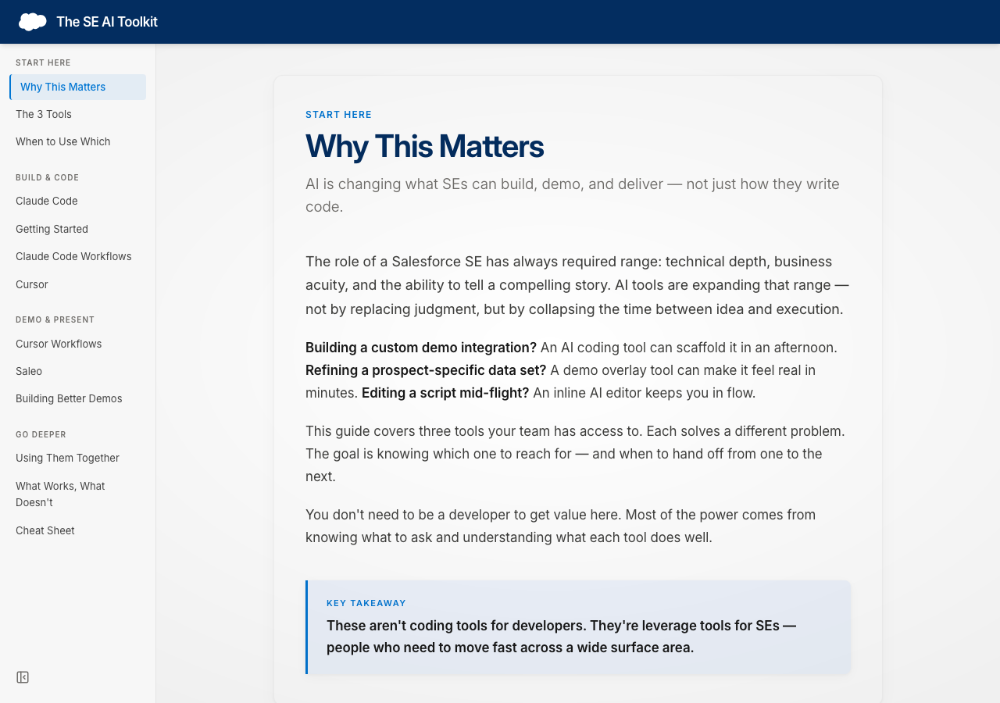

# The SE AI Toolkit

An interactive guide to AI tools for Salesforce SEs — covering **Saleo**, **MeshMesh**, **Cursor**, and **Claude Code**.

Built as a companion site for the "How I AI" enablement session. The first sections are designed for live virtual presentation (slide carousels), and the rest serves as a take-home reference with tool deep-dives, workflows, and a cheat sheet.

Hosted at **[https://jarteaga-sf.github.io/se-ai-toolkit/](https://jarteaga-sf.github.io/se-ai-toolkit/)** — just open the link.



## What's Inside

| Tier | Sections | Format |
|------|----------|--------|
| **The Big Picture** | What, How, Why | Slide carousels (presentation mode) |
| **The Tools** | Saleo, MeshMesh, Cursor, Claude Code | Tabbed deep-dives (reference) |
| **Keep Going** | Level Up, Cheat Sheet | Advanced concepts + quick reference |

## Related

- **[Salesforce Skills Library](https://jarteaga-sf.github.io/sf-skills-site/)** — Pre-built skills to install in Claude Code or Cursor for Salesforce development

## Tech Stack

- Vite + React
- Tailwind CSS v4
- shadcn/ui components
- Lucide React icons

## Getting Started

```bash
npm install
npm run dev        # localhost:5173/se-ai-toolkit/
npm run build      # production build
```
